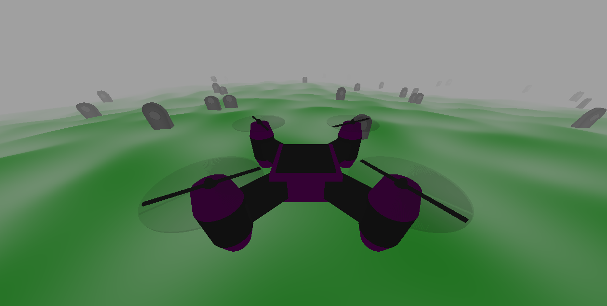

# Drone Mini game

## :sparkles: Introduction
This project is a concept drone simulation game made in C++ using OpenGL. The player controls a drone as it flies through a foggy graveyard,
The goal of the project was to familiarize myself with OpenGL and GLSL shaders.

## :video_game: Features

- Randomly generated terrain and obstacles
- Fog effect
- Collision detection
- Realistic terrain shape and obstacles

## :camera: Screenshots

### Hitbox visualization

